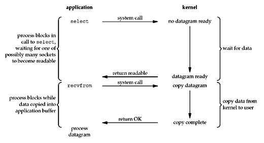

# I/O

# I/O模型

五种I/O模型：

* 阻塞I/O
* 非阻塞I/O
* I/O多路复用
* 信号驱动I/O
* 异步I/O

一般一个输入操作会经历以下两个阶段：

1. 等待数据就绪。这包括等待数据从网络上到达，然后在内核中将数据包拷到缓存。
1. 将数据从内核拷到应用程序。这包括将数据从内核缓存拷到应用程序缓存。

## 阻塞I/O

默认的套接字模型。

这里不关心recvfrom的具体实现。在BSD中是系统调用，在System V中是一个调用getmsg的函数。

## 非阻塞I/O

* 前三次调用recvfrom，不返回任何数据，内核直接返回EWOULDBLOCK错。
* 第四次调用recvfrom，数据就绪，内核将数据拷到用户空间，recvfrom返回成功。

## I/O多路复用

这里的select可能是其他实现多路复用的函数。它本身是阻塞的，调用select时我们会指定若干需要等待的描述符，任意描述符就绪之后都会返回。此时再通过recvfrom读取数据。

和**阻塞I/O**的比较

* 缺点：需要两个系统调用 (select + recvfrom)。
* 优点：可以同时等待多个描述符。

## 信号驱动I/O

* 启动套接字，并通过sigaction安装信号处理函数。立即返回。
* 当数据报文就绪时，生成SIGIO信号。此时有两种处理办法：
    * 调用recvfrom读取数据，同时通知主循环数据读好了，可以处理。
    * 通知主循环读取数据并进行后续处理。

## 异步I/O

* 调用aio_read，将以下信息传递给内核：
    * 描述符、缓存指针、缓存大小（和read相同）。
    * 文件偏移（和lseek类似）。
    * 操作结束后如何通知。
  此调用立即返回。
* 当数据完成到应用缓存的拷贝后才发送信号。

异步I/O和信号驱动I/O的区别是：

* 在信号驱动I/O中内核通知我们什么时候可以启动I/O操作。
* 在异步I/O中内核通知我们什么时候I/O操作已经完成。
